# Store Order & Inventory Mini-System

A simple, concurrency-safe Store Order & Inventory system built with **Laravel 13** and **PHP 8.4**. It provides a RESTful API, background queue processing, automated unit/feature tests, and an interactive Store Billing UI based on the assignment wireframe.

---

## Features

- **Order Processing**: Create orders with single/multiple products, subtotal and tax calculations, and customer auto-linking.
- **Stock Concurrency Safety**: Uses database transactions (`DB::transaction`) and pessimistic row locking (`lockForUpdate()`) to prevent stock overselling.
- **Low-Stock Alerts**: API and UI monitoring for products at or below configurable stock thresholds.
- **Queued Email Job**: Background queue job (`SendOrderConfirmationJob`) simulating order confirmation emails after transaction commit (`$this->afterCommit()`).
- **Store Billing Web UI**: Interactive billing dashboard matching the assignment wireframe with live total calculations, balance return computation, and printable invoice receipts.

---

## Tech Stack

- **Backend**: PHP 8.4, Laravel 13
- **Database**: MySQL
- **Frontend**: Blade, JavaScript, CSS
- **Testing**: PHPUnit 12

---

## Quick Start Guide

### 1. Setup Environment
```bash
cp .env.example .env
composer install
php artisan key:generate
```

### 2. Run Database Migrations & Seeders
Configure your database credentials in `.env` (MySQL), then run:
```bash
php artisan migrate --seed
```

### 3. Run Queue Worker
To process background email confirmation jobs:
```bash
php artisan queue:work
```

### 4. Start Application
```bash
php artisan serve
```
Open `http://localhost:8000` to access the Store Billing UI.

---

## API Endpoints

| Method | Endpoint | Description |
| :--- | :--- | :--- |
| `POST` | `/api/orders` | Create an order (deducts stock, calculates tax/totals, queues email) |
| `GET` | `/api/customers/{email}/orders` | Retrieve customer order history (returns 404 if email not found) |
| `GET` | `/api/products/low-stock` | Retrieve low-stock products (`?threshold=5`) |
| `GET` | `/api/customers/lookup` | Find existing customer by email (`?email=jane@example.com`) |
| `GET` | `/api/products` | Retrieve available product catalog |

### Sample Order Payload (`POST /api/orders`)
```json
{
  "customer": {
    "name": "Jane Doe",
    "email": "jane@example.com"
  },
  "items": [
    { "product_id": 1, "quantity": 2 },
    { "product_id": 2, "quantity": 1 }
  ]
}
```

---

## Database Design

- **`customers`**: `id`, `name`, `email` (unique)
- **`products`**: `id`, `name`, `code` (unique), `price`, `tax_percentage`, `stock` (indexed)
- **`orders`**: `id`, `customer_id` (FK), `subtotal`, `tax`, `grand_total`
- **`order_items`**: `id`, `order_id` (FK), `product_id` (FK), `quantity`, `unit_price`, `tax_percentage`, `line_subtotal`, `line_tax`, `line_total`

---

## Concurrency & Stock Safety

1. **Database Transactions**: All operations execute inside `DB::transaction()`. If stock is insufficient, the transaction rolls back cleanly and returns an `HTTP 422` error.
2. **Pessimistic Locking**: `Product::whereIn('id', $ids)->lockForUpdate()` holds an exclusive database lock on product rows during checkout.
3. **Oversell Prevention**: If two concurrent requests try to purchase the final available item of stock, **exactly 1 succeeds and 1 fails cleanly**. Stock never becomes negative.

---

## Automated Testing

Run the full PHPUnit test suite:
```bash
php artisan test
```
Automated tests cover successful order creation, multi-product calculations, stock deduction, stock shortage handling, validation errors, customer order history (200 & 404), low-stock filtering, queued job dispatching, and concurrent stock requests.

---

## Key Design Decisions

1. **Price Snapshotting**: Unit prices and tax percentages are saved directly on `order_items` at checkout time so future product price changes do not alter past customer receipts.
2. **Email Customer Auto-Linking**: Customers are identified by unique email (`Customer::firstOrCreate()`), automatically linking repeat orders to existing accounts.
3. **Pessimistic Locking (`lockForUpdate`)**: Locks the product database row during checkout so simultaneous orders wait in line safely, preventing stock overselling without needing retry loops.

---

## AI-Assisted Development & Prompt Log

This project was developed using an iterative AI-assisted workflow. Screenshots capturing the exact prompt history for each step are stored in the `prompts/` directory:

| Step | Development Phase | Prompt Screenshot |
| :--- | :--- | :--- |
| **Step 1** | System Analysis & Planning | 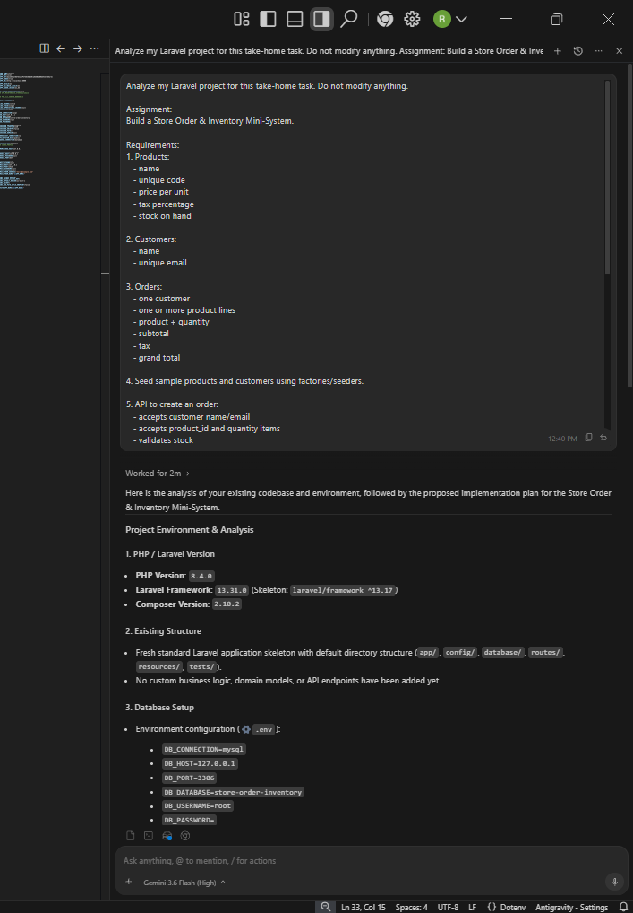<br>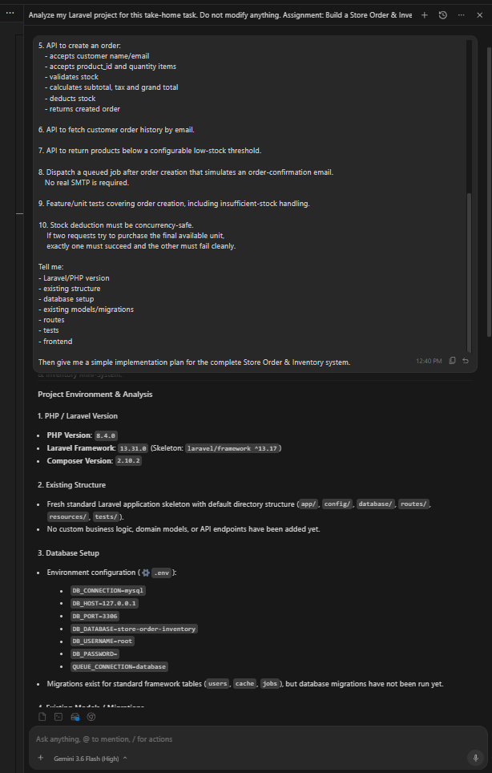 |
| **Step 2** | Database Migrations | 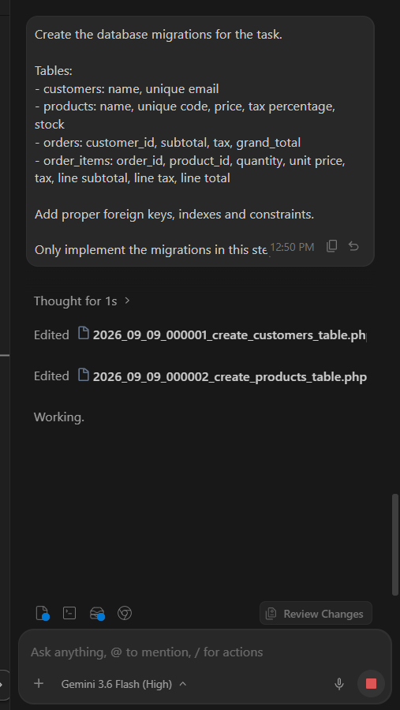 |
| **Step 3** | Eloquent Models & Relationships | 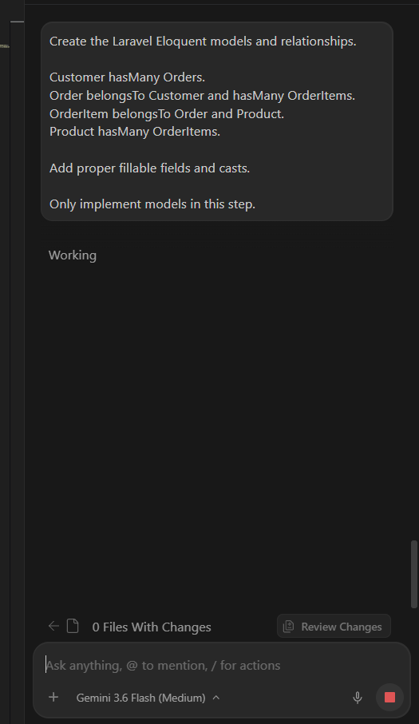 |
| **Step 4** | Factories & Database Seeders | 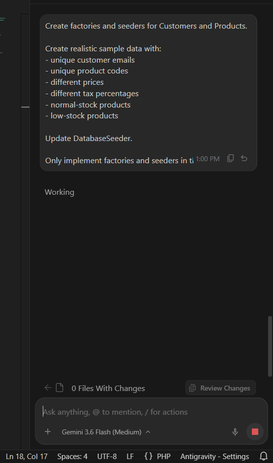 |
| **Step 5** | Form Request Validation | 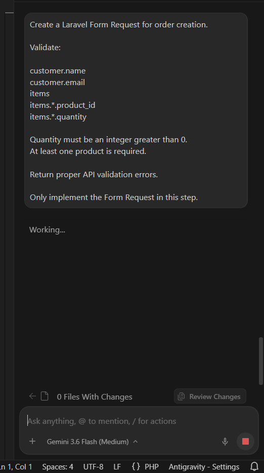 |
| **Step 6** | Order Service & Concurrency Logic | 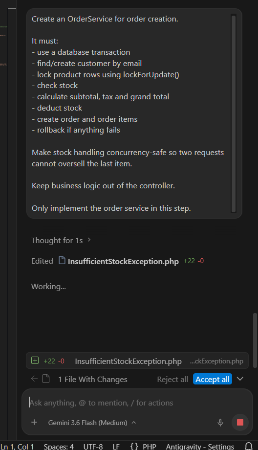 |
| **Step 7** | Create Order API | 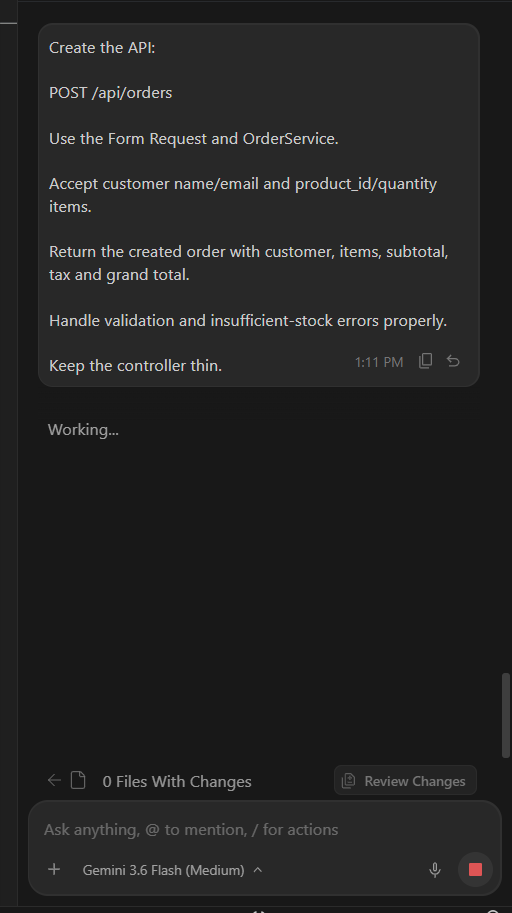 |
| **Step 8** | Customer Order History API | 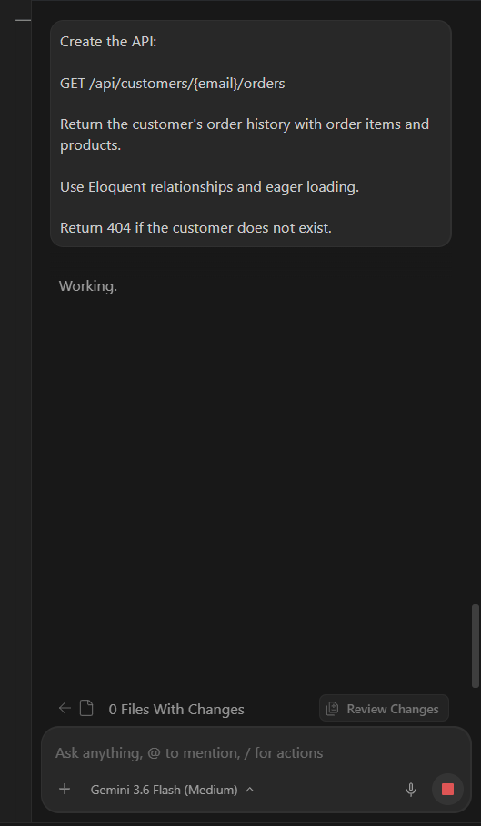 |
| **Step 9** | Low-Stock API | 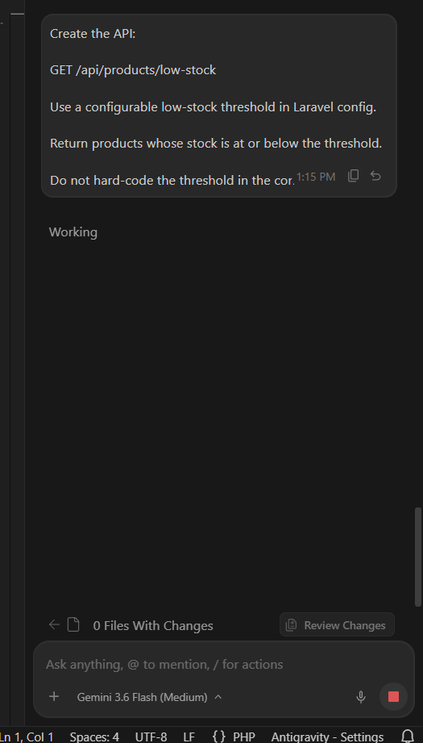 |
| **Step 10** | Queued Order Confirmation Job | 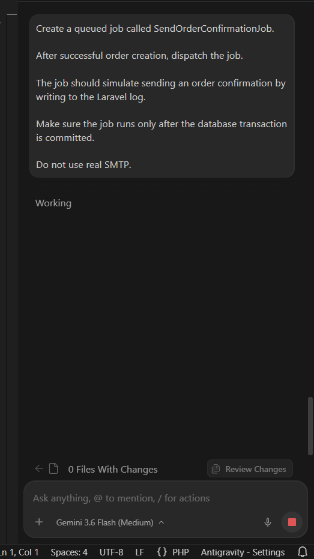 |
| **Step 11** | Automated Testing | 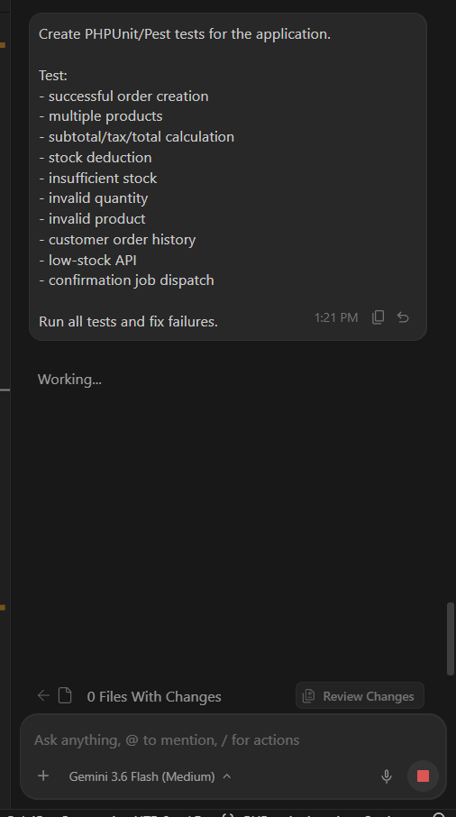 |
| **Step 12** | Stock Concurrency Safety Test | 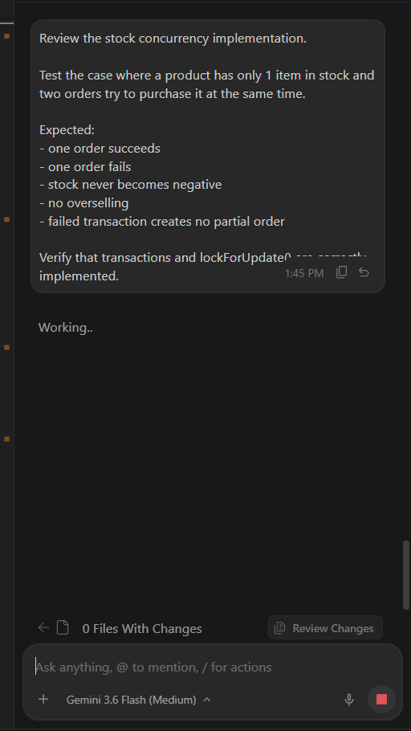 |
| **Step 13** | Store Billing Interface (UI) | 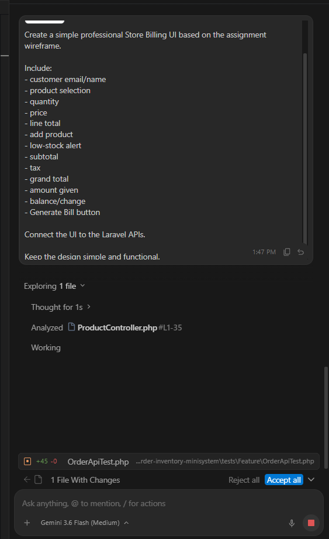 |
| **Step 14** | Code Review & Audit | 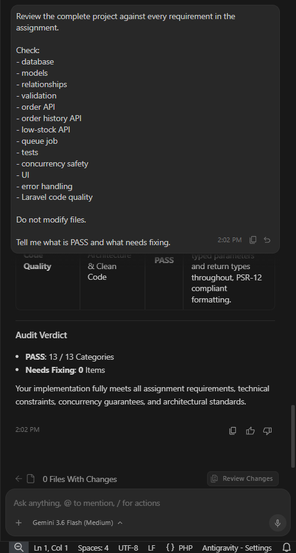 |

